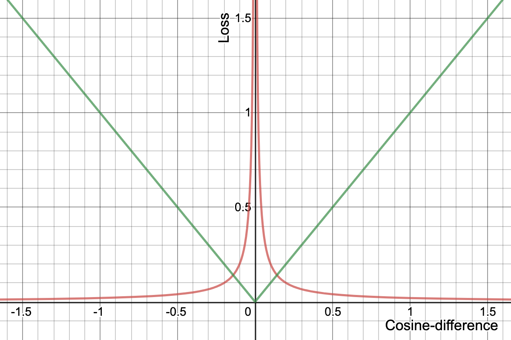

# Context-Less Semi-Supervised Embedding Clustering
Cluster context-less embedded language data in a semi-supervised manner.


## 1. Installation and Usage

```
pip install git+https://github.com/RubenPants/SemiSupervisedClustering.git
```


## 2. Usage

Two notebooks demonstrate the usage of this package via a walking example where Flemish universities are clustered together. The first notebook ([demos/1_default_usage.ipynb](https://github.com/RubenPants/SemiSupervisedClustering/blob/master/demos/1_default_usage.ipynb)) shows the default usage of the package, where the second notebook ([demos/2_embedding_init.ipynb](https://github.com/RubenPants/SemiSupervisedClustering/blob/master/demos/2_embedding_init.ipynb)) shows how to initialise the models using pre-existing sentence embeddings. The latter may be useful if synonyms (that happen to be written differently) occur regularly in the data and these pre-trained embeddings already incorporate these synonyms.

The three main parts of the algorithm are:

- Loading in the model:

    ```python
    model = EmbeddingModel(
        name: str,
        path_model: Path,
        path_data: Path,
        clean_f: Callable[..., str] = lambda x: x,
        vocab_size: int = 300,
        encoder_type: str = 'bpe',
        model_layers: List[int] = (100, 100,),
        normalise: bool = True,
        cluster_thr: float = .9,
    )
    ```

- Initialising the model components:

    ```python
    model.initialise_models(
        data: List[str],
        reset: bool = False,
        n_min_clusters: int = 5,
        show_overview: bool = False,
    )
    ```

- Training the embeddings:

    ```python
    model.train(
        data: List[str],
        batch_size: int = 512,
        n_neg: int = 32 * 512,
        n_pos: int = 32 * 512,
        n_replaces: int = 20,
        epochs: int = 5,
        iterations: int = 8,
        n_val_cluster: int = 10,
        n_val_discover: int = 2,
        n_val_uncertain: int = 2,
        show_overview: bool = False,
        cli: bool = False,
    )
    ```

    


## 3. Package

The main problem this package tries to solve is to create meaningful sub-word embeddings for textual data without context, that can be used for clustering. There are three main pillars to solve this problem:

- **Handling context-less data:** Since no context is given, traditional embedding-techniques such as CBOW or skip-gram cannot be used.
- **The problem is a clustering problem:** The solution should be able to assign a suitable cluster to each of the given (text-) inputs.
- **Noise should be taken into account:** Not all input-data should belong to a cluster. In other words, the clustering technique should handle such *noise* by don't adding it to any cluster.

### 3.1. Context-Less Data

Traditional sub-word embedding techniques such as CBOW or skip-gram rely on context in order to learn meaningful embeddings. Say for example the sentence *"the fox jumped over the lazy dog"*. A good embedding *knows*, for example, that *"lazy"* as an adjective and could be substituted with words as *"happy"* or *"calm"* but not with the word *"chair"*. In other words, these techniques are able to identify which sequence of words are likely to make sense and which do not. This *sequence of words* can be seen as its *context*.

Unfortunatly, this context is not always available or useful. Say for example one would like to make the distinguish between very similar words. Since these pre-trained embeddings range over a large variety of words, it's likely that these similar words are represented within the same part of the complete embedding space. In other words, it is hard to exploit the differences between these synonyms or same-context words since these differences are only minor in the embedding space.

Another problem is that these pre-trained embeddings have a difficult time to understand names (and name-synonyms). Say for example the three sentences *"I studied at the KUL"*, *"I studied at the Catholic University of Leuven"*, and *"I studied at the University of Ghent"*. A good embedding would likely know that *"KUL"*, *"Catholic University of Leuven"*, and *"University of Ghent"* are all schools, but wouldn't be aware that *"KUL"* and *"Catholic University of Leuven"* represent the same school.

### 3.2. Semi-Supervised Clustering of Embeddings

Since the goal of our embeddings is to be well-suited for clustering, the embeddings are trained based on these clusters. In layman terms, we want all the separate sentence embeddings of the same cluster to be close to each other in the embedding-space, while being far away from samples that do not belong in this cluster (i.e. samples that belong to other clusters or noise). 

To maximise clustering accuracy, the embedding-space is reshaped at each iteration-step during training. This training of the embedding-space is performed in two sequential steps:

- **Push:** Let two samples that do not belong in the same cluster repulse each other.
- **Pull:** Pull two samples that belong in the same cluster together.

The loss functions corresponding these two training steps are shown in the image below (*push* in red, where *pull* in green).


Training happens with several iterations of these push-pulls, alternated with a validation-step at the end of each epoch. This validation-step proposes new samples to validate, of which the model is uncertain. This helps to label the more relevant samples, with the result that less samples should get labeled before getting satisfactory results. To help validating clusters, a CLI prompt is provided (if requested).

At inference, all samples that are *close enough* to a cluster's centroid are considered to be in that cluster. This cluster centroid is the mean embedding of all the labeled sample's embeddings that belong to that cluster. The similarity metric used is cosine-similarity. To handle the trade-off between precision and recall, the similarity-threshold can be updated, where a lower threshold would favor recall at the cost of precision. The default similarity threshold is equal to `0.9`.

### 3.3. Handling Noise

An important aspect of this algorithm is how noise is handled. *Noise* are the textual samples that do not belong to any cluster, and thus should have embeddings that are not close to any of the cluster's centroids. Noisy samples are only used as repulsion-vectors at the *push*-stage during training, implying that their best embedding would be one that is as far away as possible from any of the existing cluster-centroids.

If it is requested to not consider noise, and thus always assign a sample to the closest cluster, you should lower the similarity-threshold to `-1`. Furthermore, in this scenario it wouldn't make sense to add noisy-samples in the sample, so be sure to remove all training-data where the cluster-ID is equal to `None`.

### 3.4. Model Implementation

This section gives a little more details into the working of the model. There are three main components present in the model:

- **Encoder:** This encodes the raw inputs (sentences) into machine-interpretable embeddings, represented by a multi-hot vector (sub-word count). It is also one of the important regularization aspects during training, since the sub-words are trained by sampling the encoder. For example, even if the word `"university"` exists with the encoder, it might get sampled into `["uni", "vers", "ity"]` during training. This helps to generatlise over slight changes in inputs, such as typos.
- **Embedder:** This will embed the multi-hot encoded vectors (received from the encoder) into dense embeddings using a Multi-Layer Perceptron. The number of layers used, size of each layer, and to use normalisation or not can be hyper-tuned.
- **Clusterer:** This will cluster the dense embeddings to the most suitable cluster. Here is where all the data (training, validation, cluster centroids) is located, and also where the sampling seen during training happens. 

### 3.5. TensorBoard Projector

To help analyse the created clusters, a *TensorBoard Projector* method exists within the `EmbeddingModel`.


 The results of the embeddings created in the [demos](https://github.com/RubenPants/SemiSupervisedClustering/blob/master/demos) are displayed by the following figures. Note that the unclustered samples are removed from the images.


